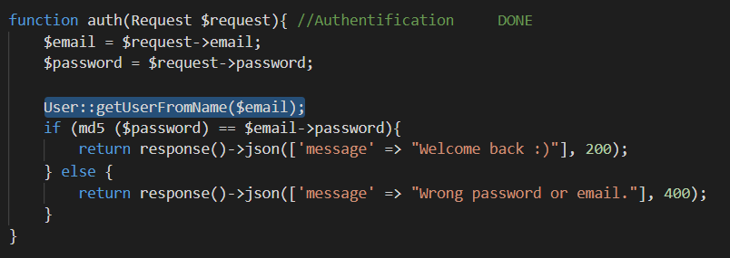
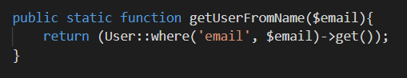
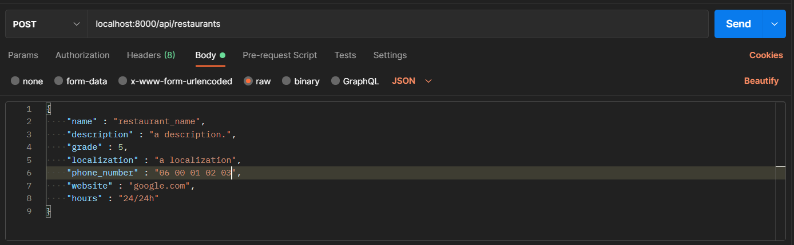
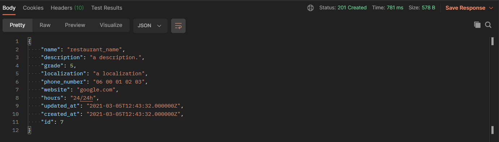

# Groupe de hadjia_i

# Prérequis :

- Installation de <B>Laravel</B> avec <B>composer</B>.  
- Configuration de <B>MAMP PRO 4</B>. 
    Lancer le serveur et vérifier que les ports soient bien configurés (notemment <B>MySQL</B>).  
- Configurer le fichier <i>.env</i> de <B>Laravel</B> avec les informations de la base de données pour pouvoir s'y connecter.  

# Préparation de la Base De Données :

- Mise en place des fichiers migrations avec la commande : 
    <i>php artisan make:migration {name}</i>  
- On ajoute les bonnes colonnes dans les tables correspondantes et lance avec la commande : 
    <i>php artisan migrate</i>  
- Mise en place des fichiers seeders avec la commande : 
    <i>php artisan make:seeder {name}</i>  
- Après configuration, on lance la commande : 
    <i>php artisan db:seed</i>  

# Mise en place des Routes :

- Dans le fichier app/routes/api.php : 
    <i>Route::<B>{method}</B>('<B>/{path}</B>', [<B>{name}</B>Controller::class, '<B>function</B>']);</i> 
        (Les mots en <B>gras</B> sont à personnaliser pour chaques routes)  
- On se place dans ce fichier pour ne pas avoir à mettre le mot <B>api</B> devant le <B>/path</B> dans les routes.  

# Construction des Controllers et des Models

- Mise en place des fichiers Controllers avec la commande : 
    <i>php artisan make:controller {name}</i>  
- Chaques Routes précédemment misent en place dans le fichier route à sa propre fonction dans la classe correspondante.  
    <B>Exemple :</B> 
        Cette route : <i>Route::post('/auth', [UserController::class, 'auth']);</i> 
        Fait appel à : La <i>fonction</i> <B>auth</B> de la <i>classe</i> <B>UserController</B>  
- Cependant, ces mêmes Controllers font appel à des Models pour éviter d'avoir tout le code dans les fichiers Controllers.  
    <B>Exemple :</B> 
        Cette fonction dans <i>UserController.php</i> :  
          Fait appel à cette fonction dans le Model <i>User.php</i>    

# Phase de Test avec Postman

- Le logiciel <B>Postman</B> va nous permettre de tester nos routes avec des requêtes.  
- Il suffit de séléctionner la méthode <i>-Dans notre cas : get, post, put, delete-</i> et de rentrer le path, par exemple : <i>localhost:8000/api/users</i>  
- Il est également possible de rentrer des informations, par exemple dans le cas d'une méthode <i>post</i> ou <i>put</i>.  
    <B>Exemple :</B> 
        Pour une requête post visant à créer un nouveau restaurant :     
- On analyse ensuite la réponse affichée par Postman et on vérifie que le Status_code renvoyé est bien le bon et que l'objet a bien été créé.  
    <B>Exemple :</B> 
        Pour la requête envoyée précédemment, on a la réponse :    
- Tout est correct et l'objet est maintenant dans la base de données : La route est fonctionnelle.   

# Fin
